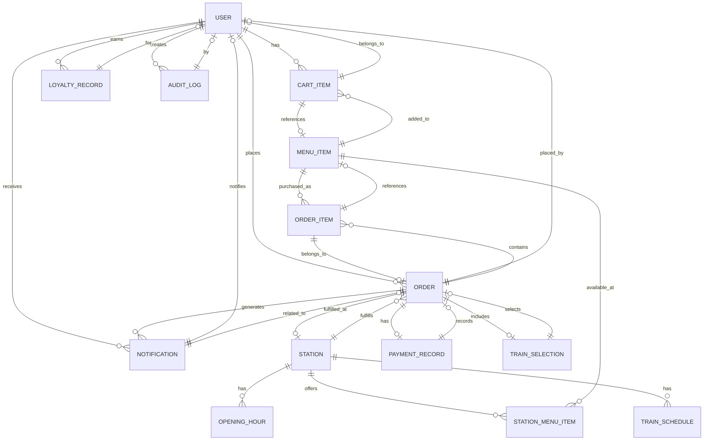

# Whistlestop Coffee Hut - UML Database Design

## Project Overview
This document outlines the database architecture for the Whistlestop Coffee Hut ordering system. The system supports customers in ordering coffee and food items from various train stations, with features including cart management, order processing, loyalty rewards, and payment handling.

---

## Database Entity Relationship Diagram (ERD)

---

## UML Class Diagram

```mermaid
classDiagram
    class User {
        -String id
        -String name
        -String email*
        -String phone
        -String passwordHash
        -Role role
        -Int loyaltyPoints
        -Int loyaltyStamps
        -DateTime createdAt
        -DateTime updatedAt
        +addToCart()
        +placeOrder()
        +updateLoyalty()
        +getNotifications()
    }

    class Station {
        -String id
        -String name
        -String slug*
        -String location
        -Boolean isActive
        -DateTime createdAt
        -DateTime updatedAt
        +getOpeningHours()
        +getMenuItems()
        +getOrders()
        +getTrainSchedules()
    }

    class MenuItem {
        -String id
        -String name
        -String slug*
        -String description
        -Category category
        -String imageUrl
        -Float priceRegular
        -Float priceLarge
        -Boolean isAvailable
        -DateTime createdAt
        -DateTime updatedAt
        +getStationAvailability()
        +updatePrice()
    }

    class StationMenuItem {
        -String id
        -String stationId
        -String menuItemId
        -Boolean isAvailable
        -Int stockCount
        -DateTime updatedAt
        +updateAvailability()
        +updateStock()
    }

    class CartItem {
        -String id
        -String userId
        -String menuItemId
        -Size size
        -Int quantity
        -DateTime createdAt
        -DateTime updatedAt
        +addItem()
        +removeItem()
        +updateQuantity()
    }

    class Order {
        -String id
        -String userId
        -String stationId
        -Float totalAmount
        -OrderStatus status
        -DateTime pickupTime
        -DateTime cancelledAt
        -String cancellationReason
        -Boolean isArchived
        -DateTime archivedAt
        -DateTime createdAt
        -DateTime updatedAt
        +placeOrder()
        +cancelOrder()
        +updateStatus()
        +archive()
    }

    class OrderItem {
        -String id
        -String orderId
        -String menuItemId
        -String nameAtTime
        -Float priceAtTime
        -Size size
        -Int quantity
        +getHistoricalInfo()
    }

    class LoyaltyRecord {
        -String id
        -String userId
        -String orderId
        -LoyaltyRecordType type
        -Int pointsChange
        -Int stampsChange
        -String description
        -DateTime createdAt
        +earnPoints()
        +redeemPoints()
    }

    class PaymentRecord {
        -String id
        -String orderId*
        -String provider
        -Float amount
        -String currency
        -PaymentStatus status
        -String transactionRef
        -DateTime paidAt
        -DateTime createdAt
        -DateTime updatedAt
        +processPayment()
        +refundPayment()
    }

    class OpeningHour {
        -String id
        -String stationId
        -DayOfWeek dayOfWeek
        -String openTime
        -String closeTime
        -Boolean isClosed
        +isOpen()
        +getHours()
    }

    class TrainSchedule {
        -String id
        -String stationId
        -String lineName
        -String destination
        -DateTime departureTime
        -String platform
        -DateTime createdAt
        -DateTime updatedAt
        +getSchedules()
    }

    class TrainSelection {
        -String id
        -String orderId*
        -String lineName
        -String destination
        -DateTime departureAt
        -String platform
        -DateTime createdAt
        -DateTime updatedAt
        +selectTrain()
    }

    class Notification {
        -String id
        -String userId
        -String orderId
        -NotificationType type
        -String title
        -String message
        -Boolean isRead
        -DateTime createdAt
        +sendNotification()
        +markAsRead()
    }

    class AuditLog {
        -String id
        -String userId
        -String action
        -String entityType
        -String entityId
        -Json metadata
        -DateTime createdAt
        +logAction()
        +getAuditTrail()
    }

    class Role {
        <<enumeration>>
        CUSTOMER
        STAFF
        ADMIN
    }

    class Size {
        <<enumeration>>
        REGULAR
        LARGE
    }

    class Category {
        <<enumeration>>
        COFFEE
        TEA
        PASTRY
        SNACK
        COLD_DRINK
        CHOCOLATE
    }

    class OrderStatus {
        <<enumeration>>
        PENDING
        ACCEPTED
        PREPARING
        READY
        COLLECTED
        CANCELLED
    }

    class DayOfWeek {
        <<enumeration>>
        MONDAY
        TUESDAY
        WEDNESDAY
        THURSDAY
        FRIDAY
        SATURDAY
        SUNDAY
    }

    class LoyaltyRecordType {
        <<enumeration>>
        EARN
        REDEEM
        ADJUSTMENT
    }

    class PaymentStatus {
        <<enumeration>>
        PENDING
        PAID
        FAILED
        REFUNDED
    }

    class NotificationType {
        <<enumeration>>
        ORDER_CREATED
        ORDER_UPDATED
        ORDER_READY
        ORDER_CANCELLED
        LOYALTY_UPDATED
    }

    %% Relationships
    User --> Role
    User --> CartItem
    User --> Order
    User --> LoyaltyRecord
    User --> Notification
    User --> AuditLog
    
    Station --> OpeningHour
    Station --> StationMenuItem
    Station --> Order
    Station --> TrainSchedule
    
    MenuItem --> StationMenuItem
    MenuItem --> CartItem
    MenuItem --> OrderItem
    
    StationMenuItem --> Size
    CartItem --> Size
    MenuItem --> Category
    
    Order --> OrderStatus
    Order --> OrderItem
    Order --> PaymentRecord
    Order --> TrainSelection
    Order --> Notification
    
    OrderItem --> Size
    
    PaymentRecord --> PaymentStatus
    
    TrainSelection --> Order
    
    OpeningHour --> DayOfWeek
    
    Notification --> NotificationType
    
    LoyaltyRecord --> LoyaltyRecordType
```

---

## Entity Description

### 1. User (用户)
**Purpose**: Stores customer and staff user information  
**Key Fields**:
- `id`: Unique identifier (CUID)
- `email`: Unique email address
- `role`: User role (CUSTOMER, STAFF, ADMIN)
- `loyaltyPoints`: Accumulated loyalty points
- `loyaltyStamps`: Collected stamps for rewards

**Relationships**:
- Owns multiple `CartItems`
- Places multiple `Orders`
- Has `LoyaltyRecords`
- Receives `Notifications`
- Creates `AuditLogs`

---

### 2. Station (车站)
**Purpose**: Represents each coffee station location  
**Key Fields**:
- `id`: Unique identifier
- `slug`: URL-friendly identifier
- `location`: Physical location details
- `isActive`: Operational status

**Relationships**:
- Has multiple `OpeningHours`
- Offers `StationMenuItems`
- Fulfills multiple `Orders`
- Has `TrainSchedules`

---

### 3. MenuItem (菜单项)
**Purpose**: Core product offerings  
**Key Fields**:
- `name`: Item name
- `slug`: URL identifier
- `category`: Product category
- `priceRegular` / `priceLarge`: Pricing by size
- `isAvailable`: Availability status

**Relationships**:
- Available at multiple `StationMenuItems`
- Added to multiple `CartItems`
- Purchased as multiple `OrderItems`

---

### 4. StationMenuItem (车站菜单项)
**Purpose**: Tracks per-station availability and stock  
**Key Fields**:
- `stationId`: Reference to station
- `menuItemId`: Reference to menu item
- `isAvailable`: Station-specific availability
- `stockCount`: Current stock level

**Relationships**:
- Links `Station` with `MenuItem`
- Enables location-specific inventory management

---

### 5. CartItem (购物车项)
**Purpose**: Temporary shopping cart storage  
**Key Fields**:
- `userId`: Owner of cart
- `menuItemId`: Item in cart
- `size`: Selected size (REGULAR/LARGE)
- `quantity`: Number of items

**Relationships**:
- Belongs to one `User`
- References one `MenuItem`
- Unique constraint: `[userId, menuItemId, size]`

---

### 6. Order (订单)
**Purpose**: Represents customer orders  
**Key Fields**:
- `userId`: Customer who placed order
- `stationId`: Pickup location
- `status`: Order status (PENDING, ACCEPTED, PREPARING, READY, COLLECTED, CANCELLED)
- `totalAmount`: Final order cost
- `pickupTime`: Scheduled pickup time
- `isArchived`: Staff archive status

**Relationships**:
- Placed by one `User`
- Fulfilled by one `Station`
- Contains multiple `OrderItems`
- Has one `PaymentRecord`
- May have one `TrainSelection`
- Generates multiple `Notifications`

---

### 7. OrderItem (订单项)
**Purpose**: Historical snapshot of items in an order  
**Key Fields**:
- `orderId`: Parent order
- `menuItemId`: Reference to menu item
- `nameAtTime`: Item name at purchase
- `priceAtTime`: Item price at purchase
- `size`: Size purchased
- `quantity`: Quantity ordered

**Relationships**:
- Belongs to one `Order`
- References one `MenuItem` (historical reference)

---

### 8. LoyaltyRecord (忠诚度记录)
**Purpose**: Tracks loyalty point and stamp transactions  
**Key Fields**:
- `userId`: User who earned/redeemed
- `type`: EARN, REDEEM, or ADJUSTMENT
- `pointsChange`: Points change amount
- `stampsChange`: Stamps change amount
- `description`: Reason for change

**Relationships**:
- Belongs to one `User`

---

### 9. PaymentRecord (支付记录)
**Purpose**: Payment transaction history  
**Key Fields**:
- `orderId`: Associated order (unique)
- `provider`: Payment provider
- `amount`: Payment amount
- `status`: PENDING, PAID, FAILED, REFUNDED
- `transactionRef`: Provider's transaction ID
- `paidAt`: Payment completion time

**Relationships**:
- Associated with one `Order`

---

### 10. OpeningHour (营业时间)
**Purpose**: Station operating hours  
**Key Fields**:
- `stationId`: Which station
- `dayOfWeek`: Day of week
- `openTime`: Opening time
- `closeTime`: Closing time
- `isClosed`: Whether station is closed

**Relationships**:
- Belongs to one `Station`

---

### 11. TrainSchedule (火车时刻表)
**Purpose**: Train schedule information for each station  
**Key Fields**:
- `stationId`: Station location
- `lineName`: Train line name
- `destination`: Train destination
- `departureTime`: Scheduled departure
- `platform`: Platform number

**Relationships**:
- Belongs to one `Station`

---

### 12. TrainSelection (火车选择)
**Purpose**: Customer's selected train for their order  
**Key Fields**:
- `orderId`: Associated order (unique)
- `lineName`: Selected train line
- `destination`: Train destination
- `departureAt`: Departure time
- `platform`: Platform number

**Relationships**:
- Associated with one `Order`

---

### 13. Notification (通知)
**Purpose**: User notifications  
**Key Fields**:
- `userId`: Recipient user
- `orderId`: Related order (optional)
- `type`: Notification type
- `title`: Notification title
- `message`: Notification message
- `isRead`: Read status

**Relationships**:
- Belongs to one `User`
- May be related to one `Order`

---

### 14. AuditLog (审计日志)
**Purpose**: Track system actions for compliance  
**Key Fields**:
- `userId`: User who performed action
- `action`: Action description
- `entityType`: Entity being modified
- `entityId`: ID of entity
- `metadata`: Additional JSON data

**Relationships**:
- Created by one `User` (nullable)

---

## Enumerations (枚举)

### Role
- `CUSTOMER`: Regular customer
- `STAFF`: Staff member
- `ADMIN`: Administrator

### Size
- `REGULAR`: Regular size
- `LARGE`: Large size

### Category
- `COFFEE`: Coffee beverages
- `TEA`: Tea beverages
- `PASTRY`: Pastries and baked goods
- `SNACK`: Savory snacks
- `COLD_DRINK`: Cold beverages
- `CHOCOLATE`: Chocolate drinks

### OrderStatus
- `PENDING`: Order created, awaiting acceptance
- `ACCEPTED`: Staff accepted the order
- `PREPARING`: Order being prepared
- `READY`: Ready for pickup
- `COLLECTED`: Customer collected
- `CANCELLED`: Order cancelled

### DayOfWeek
- `MONDAY` through `SUNDAY`

### LoyaltyRecordType
- `EARN`: Points/stamps earned
- `REDEEM`: Points/stamps used
- `ADJUSTMENT`: Manual adjustment

### PaymentStatus
- `PENDING`: Payment awaiting processing
- `PAID`: Payment received
- `FAILED`: Payment failed
- `REFUNDED`: Payment refunded

### NotificationType
- `ORDER_CREATED`: Order created
- `ORDER_UPDATED`: Order status updated
- `ORDER_READY`: Order ready for pickup
- `ORDER_CANCELLED`: Order cancelled
- `LOYALTY_UPDATED`: Loyalty points updated

---

## Key Design Features

### 1. Historical Data Preservation
- `OrderItem` stores `nameAtTime` and `priceAtTime` to maintain historical accuracy
- Even if menu items are updated, order history remains accurate

### 2. Soft Deletions
- Orders can be `isArchived` instead of deleted
- Provides audit trail and data recovery

### 3. Location-Specific Inventory
- `StationMenuItem` allows per-station stock and availability control
- Different stations can have different inventories

### 4. Flexible Relationships
- `Notification.userId` and `Notification.orderId` are optional
- Supports system-wide or order-specific notifications

### 5. Audit Trail
- `AuditLog` tracks all important actions
- Supports compliance and debugging

### 6. Payment Isolation
- Separate `PaymentRecord` from `Order` for payment independence
- Supports complex payment scenarios

---

## Data Constraints

| Entity | Constraint | Purpose |
|--------|-----------|---------|
| User | `email` unique | Prevent duplicate accounts |
| MenuItem | `slug` unique | Enable URL routing |
| Station | `slug` unique | Enable URL routing |
| CartItem | `[userId, menuItemId, size]` unique | One cart item per user/item/size |
| StationMenuItem | `[stationId, menuItemId]` unique | One record per station/item |
| PaymentRecord | `orderId` unique | One payment per order |
| TrainSelection | `orderId` unique | One train per order |
| OpeningHour | `[stationId, dayOfWeek]` unique | One record per station/day |

---

## Technology Stack

- **Database**: MySQL (Aiven Cloud)
- **ORM**: Prisma
- **Framework**: Next.js
- **Language**: JavaScript/TypeScript
- **Authentication**: JWT-based sessions

---

## Document Version
- **Version**: 1.0
- **Date**: April 2026
- **Project**: Whistlestop Coffee Hut - CSC8019 Team 6
- **Database**: Aiven MySQL
